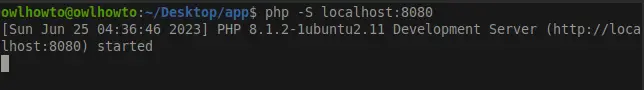

This is a shoutbox website that allows uses to Enter their name and a message that will be displayed in a display area

I am using a remote database at https://www.freesqldatabase.com/ to host my database and Heroku to host the front end
### Testing
PHP is a server side programming languguage so web pages have to be served from a server. 

 To test this website on a local machine [linux in my case]:
1. Install php so you can develop your project locally without having to upload it to your server :) IDEs like VS code might have extensions for this so probably look into it. 
I'm using a linux debian distro version 11
- `sudo apt install php`
2. Verify php installation using 
- php -S localhost:8080 [You can user whatever port you want so long as that port is not being used by another process]

3. Start a php web server in the parent folder containing the index.php folder